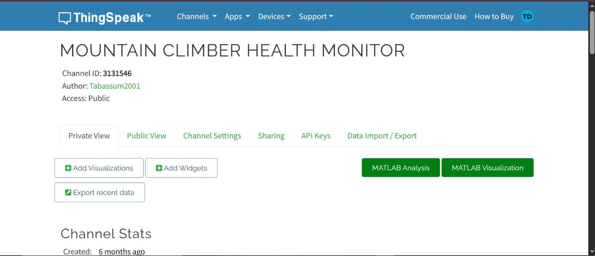
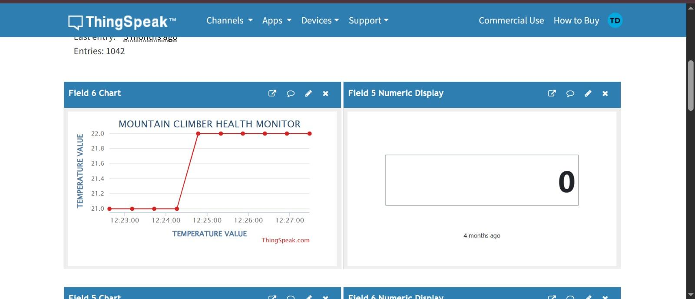
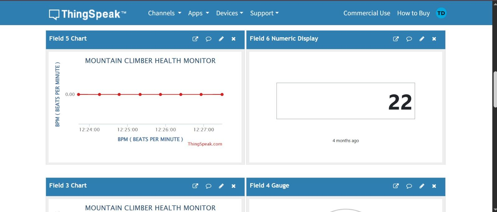
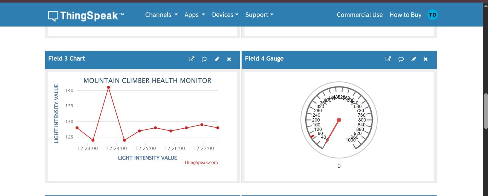
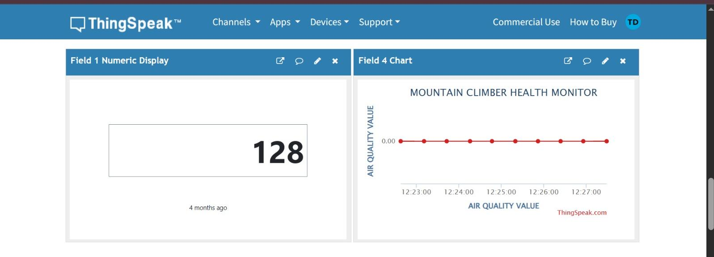
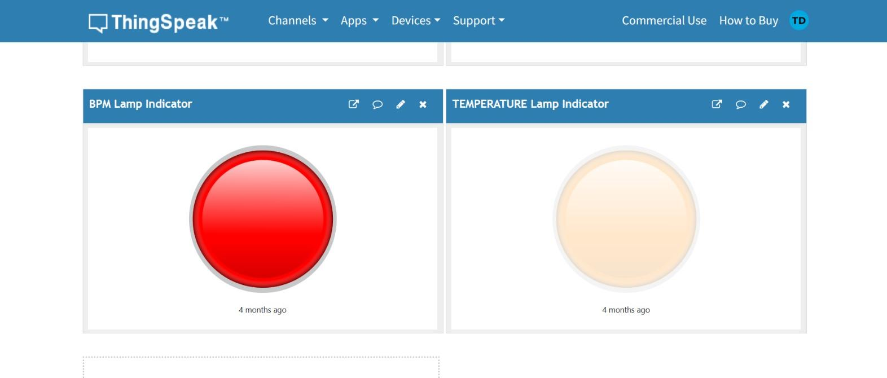

# Mountain Climber Health Monitoring System

This project is an IoT-based system designed to monitor the health and environmental conditions of mountain climbers in real-time.

## Features
- Temperature monitoring using sensor
- Heart rate (BPM) detection
- Gas and light (LDR) monitoring
- GPS location tracking
- Cloud integration using ThingSpeak
- Emergency SMS alerts

## Architecture

Sensors (Temperature, Gas, LDR, BPM)  
        ↓  
Arduino (Data Processing)  
        ↓  
ESP8266 (WiFi Module)  
        ↓  
ThingSpeak Cloud  
        ↓  
User Monitoring (Dashboard / Alerts)

## Technologies Used
- Arduino
- ESP8266
- ThingSpeak Cloud
- Sensors (Temperature, Gas, LDR)
- GPS Module

## Description
The system collects real-time data from multiple sensors and sends it to the ThingSpeak cloud platform using ESP8266. It also tracks location using GPS and sends alerts in emergency situations.
## 📊 Project Architecture
Sensors (Temperature, Gas, LDR, Heart Rate) 
→ Arduino 
→ ESP8266 (Wi-Fi Module) 
→ ThingSpeak Cloud 
→ User Dashboard + SMS Alerts

---

## Project Screenshots

### ThingSpeak Dashboard

---

### Sensor Data Graphs

---

### Indicators View

